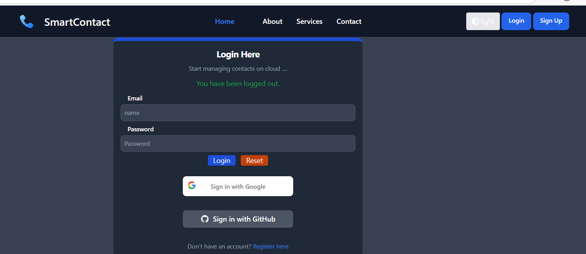
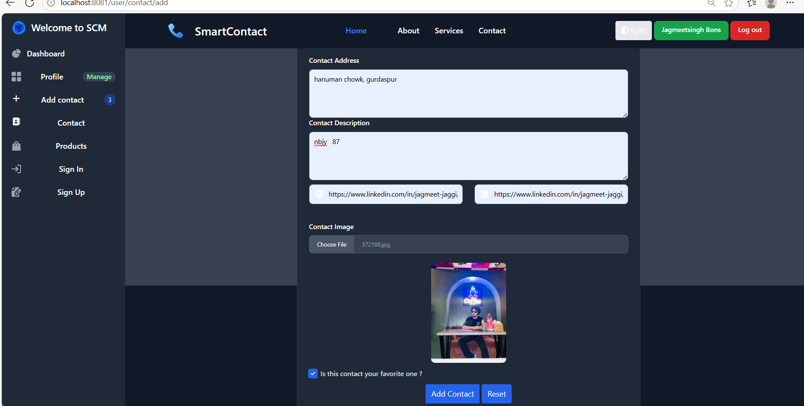
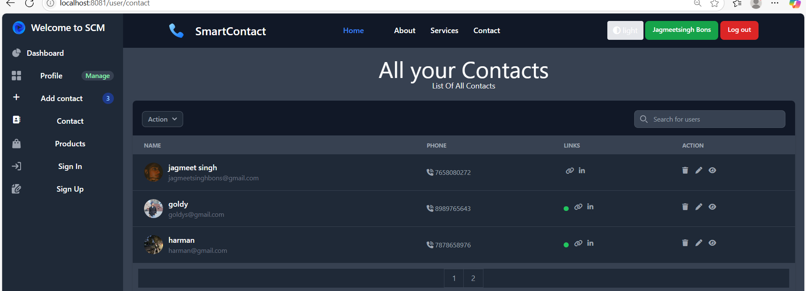

# Smart Contact Management (SCM) 🔐

 <!-- Add your main screenshot here -->

A secure cloud-based contact management system with OAuth2 authentication and CRUD operations.

## ✨ Features
- **Secure Authentication**
  - Email/password login
  - OAuth2 login (Google & GitHub)
  - Spring Security protected routes
- **Contact Management**
  - Add/Edit/Delete contacts
  - Favorite contacts marking
  - Contact details (name, email, phone, address)
- **User Experience**
  - Responsive design (Tailwind CSS)
  - Form validations
  - Dashboard analytics

## 🛠️ Technologies
**Frontend**:
- HTML5, CSS3, JavaScript (ES6)
- Tailwind CSS
- Thymeleaf templates

**Backend**:
- Spring Boot 3.x
- Spring Security (OAuth2)
- Spring Data JPA
- MySQL Database

## 🚀 Getting Started

### Prerequisites
- JDK 17+
- MySQL 8+
- Maven
